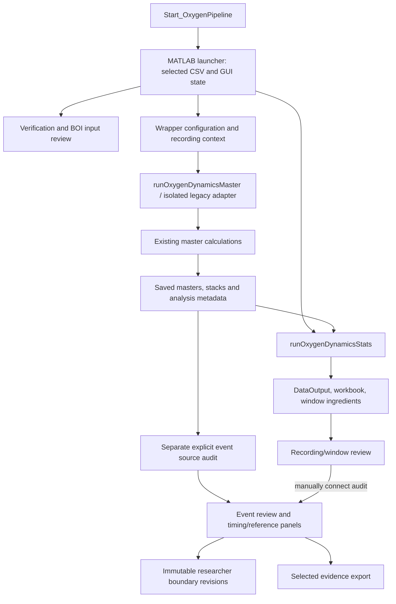

# G1 engineering baseline

23 September 2026 · SW-G1-01–05 · G1 complete; G2 awaits approval

**The BOI components have a substantial tested foundation, but the normal
application route does not yet deliver the complete reviewed workflow.** The
first implementation priority is to connect the accepted analysis configuration
and selected result consistently through the launcher, engine and review tools.
A replacement detector or cohort reanalysis is not needed for this work.

The researcher approved the roadmap and G1 with “i approve”. This report closes
G1's four deliverables: system map, fresh verification, bounded fixture proposal
and prioritized backlog. No production MATLAB code or scientific rule changed.

## 1. System map — implemented routes and user obstacles

| Researcher step | Existing implementation | G1 observation |
|---|---|---|
| Launch/import | `Start_OxygenPipeline` → `OxygenDynamics_GUI`; metadata input through `readInputTable`. | Launcher is CSV-led. Folder-level preflight exists separately. Wrapper and statistics require different metadata columns. |
| Check source/timing/support | `runOxygenPipelineVerificationReport`, `reviewBOIRecordingInput`, input/tissue contracts and import panel. | Strong validation machinery exists. It does not by itself set the detection support profile used by the wrapper. |
| Configure/run | GUI → `OxygenDynamics_Wrapper` → `createLegacyRecordingContext` → `runOxygenDynamicsMaster` → `runLegacyAnalysisScript` → master body. | Legacy workspace assumptions are already isolated in an adapter. Normal wrapper context omits `BOISupportProfile`, so the master defaults to `whole-image`; accepted recording workflows explicitly pass `craniotomy-roi-1`. |
| Summarize | `runOxygenDynamicsStats` loads saved masters, resolves contracts and exports tables, workbook and frame ingredients. | Existing GUI/batch entry points share the statistics function. This does not establish GUI/master equivalence for the accepted profile. No statistics rerun occurred in G1. |
| Inspect recording/event | `openBOIWindowReview`, `linkBOIWindowEventReview`, `openBOIEventReview`. | Existing cached ID400 results support both-sign arithmetic replay and connected window → event → return navigation. The launcher still relies on separate file selection for audits. |
| Inspect corrected trace | `buildBOITimingReviewData`, timing panels; audit trace stages if saved. | Cached ID400 audit contains corrected/filtered stages. However, the standard **Create event source audit** route passes `reconstructDetection=false`; its new audit lacks those stages. This was reproduced on an existing tiny test fixture. Missing data stays explicitly unavailable. |
| Revise/save | Boundary panel, `saveBOIBoundaryReview`, `loadBOIBoundaryReview`, separately attached reference judgments/native sources. | Revision identity and no-overwrite behavior have existing passing tests. Restoring a complete review context still involves separate attachments/files. |
| Reopen/export | Saved-audit/window loaders, `exportBOIEventReview`; regression-specific saved stats chooser in launcher. | Evidence export succeeds, but `SelectedEventReview.mat` is an evidence bundle, not a reopenable event-audit/session file. The launcher has no single persisted selected-run/review context. |

**Configuration flow to preserve and improve.** Wrapper and statistics start
with defaults, apply `OxygenDynamics_Config` sections, then merge explicit
overrides. The config-file path rejects unknown fields; the generic override
merge does not. The master parameter factory is shared, but its inputs/profile
must reach it explicitly. G2 should validate requests at the boundary rather
than replace the calculation functions or silently change defaults.

**Artifacts to connect:** source identity and sidecars → resolved settings and
support profile → master output identities → statistics result → event audit
and native attachments → review revisions → evidence exports. Existing hashes,
schemas and dictionaries remain the authority; a run/session index should refer
to them rather than duplicate scientific content.

## 2. Fresh verification

Environment: MATLAB **25.1.0.2943329 (R2025a)** on this macOS host. Exact installed
toolbox/platform information and test results are in the evidence packet.

| Check | Result | Practical limit |
|---|---|---|
| Twelve existing BOI/contract test files | **120 passed; 0 failed; 0 incomplete; 0 skipped**, approximately 162.6 seconds inside the runner. | Selected bounded tests, not every repository test or independent biological validation. |
| Eight application/review entry points inspected with MATLAB Code Analyzer | Inspection completed; 12 messages retained for review. | Message count is not a defect count or a release gate. No warning cleanup performed. |
| Existing ID400 awake saved window arithmetic | Both signs' coverage, onset rate and concurrency replay matched; saved frame/exposure checks matched. | Uses existing saved ingredients, not a fresh mask reconstruction or dataset reanalysis. |
| Existing ID400 event review | First finite event of each sign replayed; connected GUI navigation and selected-event export succeeded. Original audit/statistics hashes unchanged. | Programmatic UI exercise, not an independent researcher usability test. No movie pixels accessed. |
| Export as reopenable audit probe | Loader rejected `SelectedEventReview.mat` with `OxygenDynamics:InvalidEventReview`, as its structure differs. | A product capability gap, not evidence that the export is corrupt or existing save/reopen boundaries lose data. |
| Normal wrapper context probe | Resolves `whole-image`; explicit accepted-profile context resolves `craniotomy-roi-1`. | No master executed; result establishes configuration-path difference. |
| Default audit creation on reused 4×5×80 synthetic fixture | Four optical measurements matched; corrected and filtered trace stages were `not_saved`. | Expected current audit option behavior, but insufficient for the agreed corrected-trace review journey. No threshold/correction change. |
| Code and prior evidence preservation | All 495 pre-existing MATLAB hashes unchanged; prior planning artifacts preserved. | Repository remains deliberately uncommitted and dirty. Nothing reset or cleaned. |

The twelve suites cover contracts, timing authority, tissue support, strict ROI,
import review, event/window review, connected review, reviewed optics, context,
saved support and surge windows. Negative-path tests emitted expected fixture
warnings; MATLAB also emitted Java package warnings. They did not fail tests.
The deliberate wrong-export-loader probe emitted missing-variable warnings and
the expected validation error; it is recorded separately from test failures.

**Not run:** a full recorded-movie detector, cohort statistics, stimulation/KX
work, the broad smoke runner, remote CI, Linux/R2025b validation, installation on
a fresh machine or an independent human walkthrough. The broad smoke runner
also exercises IOSI/other ancillary workflows, so it was not used as the BOI-only
G1 gate. The current CI calls `runRepositoryChecks`, which performs Code Analyzer
inspection and a hypoxia/amyloid test; it does **not** invoke these 120 BOI tests.
This is a coverage gap, not a claim about the current remote CI run status.

## 3. Code/worktree classification

The baseline contains **495 MATLAB files**: 55 at repository root, 334 in
`helpers`, 102 in `tests`, three in `external`, and one historical `.m` recipe
under documentation. These are physical counts, not quality scores. The initial
worktree status has 258 entries, some representing entire untracked directories.
The existing tracked diff and MATLAB hashes were captured before G1 changes.

- Production entry points: launcher, wrapper/master adapter, statistics,
  source/input review, event/window review and exports.
- Compatibility boundary: `OxygenDynamics_Master.m` remains a script, called
  through `runLegacyAnalysisScript` in an isolated function context. This
  existing adapter is a useful migration boundary; no rewrite is assumed.
- Experimental/development entry points: timing/shape/branch/validation runners
  under `tests/analysis` are not automatically product features. Names/directories
  guide discovery but do not constitute a complete production dependency audit.
- Automated tests: `test*.m` files under `tests/analysis`, plus legacy root tests.
- Third-party helpers: `external`, governed by existing notices.
- Historical evidence: `docs/reference-results` and workspace
  `reference-validation`; not an executable product backlog. The existing `.m`
  documentation recipe is retained unchanged; new archived recipes use `.m.txt`.

No files were moved, deleted or refactored. Future branch/worktree preparation
must include the current modified/untracked implementation, not just Git HEAD.

## 4. Bounded regression fixture proposal

Propose **three existing recordings maximum**, covering different software
conditions. This is a test-fixture proposal, not an animal/cohort analysis plan.

| ID | Existing case | Software purpose | G1 use / later limit |
|---|---|---|---|
| FX01 | ID400 awake, strict-ROI run 112; 600 frames, 1 Hz, 4.75 µm/pixel | Representative saved-result workflow, both signs, missing optical values. | Read-only result/GUI/export exercise performed. Candidate for the first bounded integration check. |
| FX02 | FB2314 awake, strict-ROI run 033; 1,200 frames, 1 Hz, 2.35 µm/pixel | Different native calibration and stored duration; historical compatible artifacts. | Saved artifact hashes checked; no new runtime review or detector run. |
| FX03 | FB2420 local input, run 074 | Non-DANDI input path and retained metadata/history uncertainty. | Saved artifact hashes checked; no new runtime review or detector run. Read source-bound timing/calibration before any later execution; never infer unresolved values. |

The [structured fixture proposal](reference-results/software-g1-baseline-20260923/fixture-proposal.json)
contains paths, recording IDs and hashes. Raw-source hashes are inherited from
the saved run evidence; no fresh full raw-source equivalence claim is made.
All fixtures are development-exposed. Original metadata/judgments remain intact.
Synthetic fixtures remain the routine CI layer; recorded movies are limited
integration examples. G1 authorizes no future detector campaign.

## 5. Prioritized backlog and proposed next milestone

See the [eight-item backlog and G2 proposal](SOFTWARE_BACKLOG.md). The highest
priorities are: explicit support-profile propagation, corrected-trace availability
in the normal review route, and actual BOI regression coverage in CI. Existing
passing component tests make focused integration work feasible.

**G1 is complete.** Proposed G2 is a shared validated analysis request and one
selected-run context, using the current engine, with the bounded BOI checks wired
into automation. Corrected-trace capability requirements must be explicit in the
result contract; capture/review delivery remains a named follow-on item, not a
silent preprocessing change. Do not begin G2 until its stated scope is approved.

## Evidence and limits

[Local/portable evidence index](reference-results/software-g1-baseline-20260923/README.md)
links exact tests, probes, code inventory and preservation records. There was no
independent human code review this milestone. The findings combine static source
inspection with the specifically listed runtime checks; unexercised paths remain
unverified. The next milestone is software integration, not further scientific
diagnostics or reanalysis.
