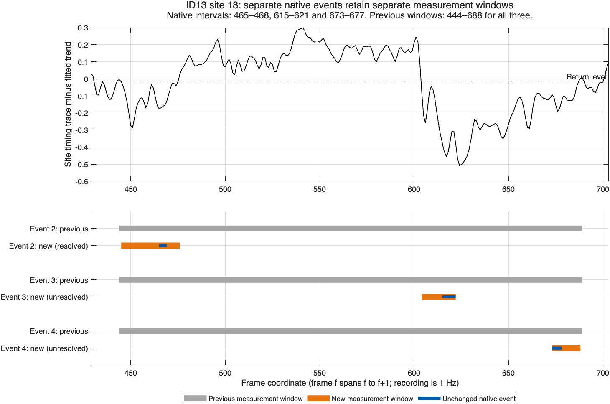

# Event-local timing reference results — 9 September 2026

All eight full recordings passed lossless conversion, master analysis, statistics
export and timing/numerical QC. The seven BOI recordings contain 976 sink events;
the separate fluorescence control contains 26. Across both signs there are 1,300
events. These audit counts are not independent biological replicates or evidence
of biological detection accuracy.

## Verified changes and invariants

- **Zero same-site measurement-window overlaps**, compared with 111 involved BOI
  sink events previously; the 60 events sharing identical windows are no longer
  assigned those shared windows.
- Every new sink window contains its native interval and extends at most 20
  seconds on either side. Unresolved edges retain their native frame and a status.
- Native masks and event identities matched the frozen reference **exactly** for
  all eight recordings. Surge timing, amplitudes, baseline statuses and areas
  also matched exactly.
- All 1,300 amplitudes, baseline values, missingness statuses and clean-sample
  counts passed independent recomputation. Full-rerun sink timing matched the
  20-second fixed-trace prediction exactly.
- 621/976 BOI sink timings are resolved under the algorithmic criteria;
  355 remain unresolved. The fluorescence control has 24/26 resolved sink timings.
  Resolved means the specified crossings were found, not that biological onset
  or recovery is known accurately.

## Per-recording sink results

Amplitude availability is independent of timing resolution. All event/site counts
remain unchanged; detailed both-sign counts are in `reference-set-summary.csv`.

| Recording | Sink events | Timing resolved / unresolved | Finite amplitudes: previous → new | Wrong direction: previous → new |
|---|---:|---:|---:|---:|
| M400-01-baseline-awake | 137 | 106 / 31 | 92 → 98 | 1 → 0 |
| M400-03-baseline-iso | 84 | 69 / 15 | 72 → 71 | 0 → 0 |
| M401-01-baseline-awake | 92 | 62 / 30 | 74 → 74 | 1 → 2 |
| M401-03-baseline-iso | 43 | 36 / 7 | 33 → 34 | 0 → 0 |
| FB2312-baseline-awake | 192 | 136 / 56 | 149 → 164 | 3 → 3 |
| FB2316-baseline | 193 | 91 / 102 | 134 → 143 | 1 → 1 |
| ID13-20200917 | 235 | 121 / 114 | 169 → 174 | 1 → 2 |
| FB2411 | 26 | 24 / 2 | 24 → 24 | 0 → 0 |

BOI sink finite amplitudes increased from 723 to 758, while wrong-direction sink
amplitudes increased from seven to eight. The ten wrong-direction surge amplitudes
are unchanged. The timing correction was not selected to improve amplitude sign
agreement, and these counts must not be used as accuracy estimates.

## Recurring-event example

At ID13 site 18, native events 2/3/4 span 465–468, 615–621 and 673–677.
Previously, each had the same 444–688 measurement interval (245 seconds).
They now have separate intervals: **445–475**, **604–621**, and **673–687**.
Event 2 satisfies the resolution criteria. Event 3 retains its native end with
unresolved recovery; event 4 retains its native start with unresolved onset.
Both partial resolutions remain explicitly flagged.

## Sensitivity and remaining limitations

The prespecified 5/10/20/40-second fixed-trace sweep resolved 298/469/621/730
BOI sink timings respectively, with no same-site overlaps at any setting.
Increasing the limit finds more distant crossings; this does not establish that
those crossings are more accurate. The 20-second default is a development
safeguard and needs known-signal validation, not optimization to existing counts.

Timing still uses the whole-site filtered trace and polynomial trend. The native
event footprint and whole-site signal can differ. Normalized spatial contrast
also remains distinct from preserved-input change from baseline. These concerns
are not solved by bounding the timing search.

Unresolved rows retain their observed measurement windows and finite amplitudes
when a clean baseline exists. Existing descriptive duration/composite summaries
still include them. Do not interpret those summaries as fully observed episode
durations; prespecify how unresolved timing enters publication outcomes. The
new EventMeasurementQC counts and event-level statuses make this explicit.

## Provenance and validation

Numerical rerun: commit `2048318`, with an unchanged source-hash manifest at
completion. The only subsequent MATLAB-source adjustment removes an obsolete
Code Analyzer suppression in the sensitivity utility. Measurement identity is
`event-footprint-local-timing-2`; statistics identity is `mouse-strict-3`.
Old saved analyses are rejected and must be rerun before pooling with this version.

All 46 focused tests, the full smoke suite and final repository checks passed
(339 MATLAB files inspected; 51 pre-existing Code Analyzer messages remain).
The comparison includes exact identity/mask checks, independent amplitude audit
and agreement with the fixed-trace prediction. These are numerical validation,
not sensitivity/specificity estimates.

The initial attempt was stopped because relative paths in the harness prevented
statistics from finding the recording folder. The runner now canonicalizes all
roots, and the complete successful run exercised that fix. The superseded attempt
is retained locally with an explicit status note; its missing values are not
zero detections.

Full local outputs are in the sibling workspace directory
`reference-validation/local-timing-rerun-20260909/`; sensitivity outputs are in
`reference-validation/local-timing-sensitivity-20260909/`. Large image stacks/MAT
outputs are not committed. Exact archive assets and acquisition metadata remain
pinned in [the reference profile](../../reference-set-phase1.json).
See [timing definitions](../../LOCAL_SINK_TIMING.md) for the rule and exported fields.

## Next work

Validate the timing trace, return threshold and search horizon using injected
recurring events, controlled global/local trends and noise. Compare whole-site
and event-footprint timing support, keeping native identities fixed. Then test
spatial normalization and physical-unit settings. Do not tune to these event
counts or treat agreement between normalized and raw signs as ground truth.
