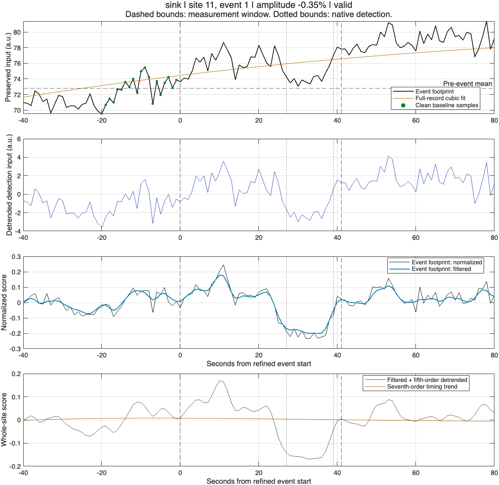
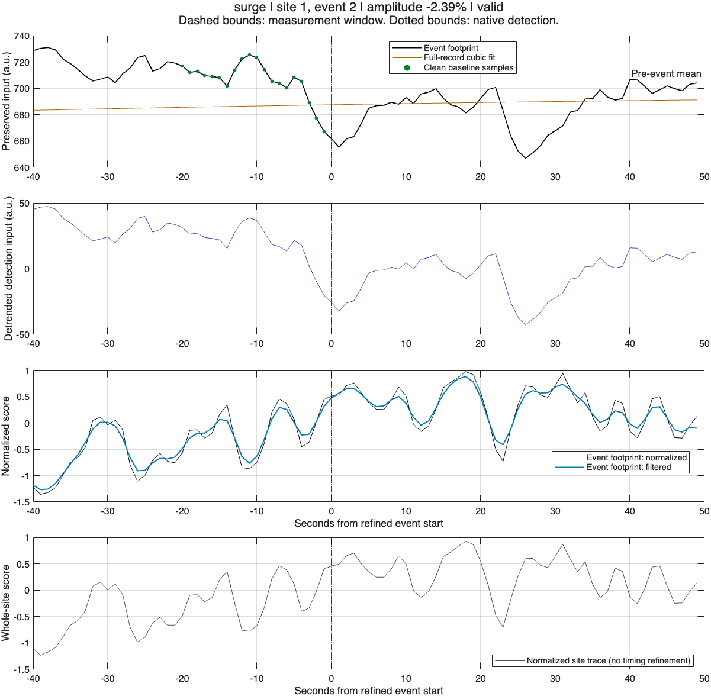
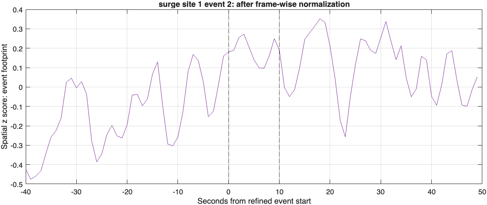
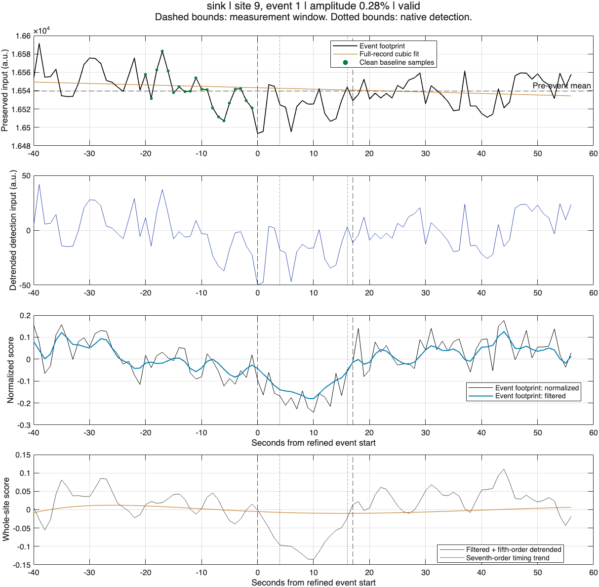

# Signal audit results — 9 September 2026

All **1,300 events** from the frozen eight-recording reference set matched an
independent reconstruction of preserved-input event-footprint amplitude,
baseline value, missingness status and clean sample count. All reconstructed
saved normalized site traces and sink timing traces passed their checks. This
establishes calculation consistency; the following event-definition problems
remain unresolved. It does not establish biological accuracy.

## 1. Sink timing loses separation between recurring events

Among 976 BOI sink events (fluorescence control excluded):

- 207 have a refined start more than 20 seconds before native detection;
  the maximum extension is 229 seconds.
- 192 extend more than 20 seconds beyond the native end; maximum 220 seconds.
- 111 have overlapping measurement windows with another event at the same site.
- 60 share an identical measurement window with another event at the same site.
  Counts concern involved events, not independent pairs.

For ID13 site 18, native events 2, 3 and 4 occupy frames 465–468, 615–621 and
673–677. All three receive the identical refined interval 444–688 (245 seconds).
The native masks and event counts remain separate, but timing is no longer
local to those events. This can distort durations, baseline placement and
amplitude comparisons. Native-mask union occupancy is not replaced by those
expanded intervals.

The existing sink routine searches arbitrarily far before/after the seed for
samples whose absolute distance from a seventh-order fitted trend falls inside
a fixed tolerance. It does not bound that search by adjacent native events or
require the search to stay on the relevant trough. Samples may cross a trend
without landing inside the tolerance band. Whole-site trace support can also
differ from an individual event footprint. These mechanisms require a targeted
replacement and explicit failure/overlap flags, rather than a silent truncation.

A counterfactual using native bounds, with the same footprints and clean-baseline
rules, increased finite BOI sink amplitudes from 723 to 790, but wrong-direction
sink amplitudes increased from 7 to 10. Four previously flagged sink amplitudes
became nonnegative, while other flags appeared. Native bounds are therefore a
useful comparator, not a validated final timing rule. Surge bounds and all surge
measurements were unchanged in this counterfactual.

## 2. Normalized contrast and preserved-input change can disagree

There are 17 wrong-direction finite amplitudes: seven sinks and ten surges,
all in BOI recordings. All 17 match independent raw-pixel recomputation.

In ID400 awake, sink site 11/event 1 has a raw change of +0.350% at its raw
minimum relative to its clean baseline, hence a sink amplitude of −0.350%.
The fitted cubic component contributes +3.143 percentage points and the
residual −2.793. Its normalized trace nevertheless shows a trough. A cubic
component is not proof of instrumental drift; biological changes can also
contribute to it.

For all six flagged FB2312 surges, the event-footprint change at the raw amplitude
extremum is negative after cubic detrending but positive after frame-wise spatial
normalization, relative to the same clean pre-event samples. Temporal normalization
retains that positive change. The exact values are in `FB2312-normalization-stages.csv`.
For site 1/event 2, these changes are −18.580 detrended input units, +0.211 spatial
z-score units and +0.596 final normalized-score units. Different units must not
be compared as amplitudes.

The frame operation `(pixel − frame mean) / frame SD` removes a changing spatial
reference. A location can become relatively brighter even as its own intensity
falls. Pixelwise temporal standardization and spatial averaging then further
define the detection score. The audit found no disagreement with the implemented
SD formulas; it demonstrates why the resulting detection label is not equivalent
to a raw local increase or decrease from a pre-event baseline. This does not
establish which representation best identifies biological oxygen events.

## 3. Fluorescence-control detections remain diagnostic

The control has 26 sink-labelled events and one surge-labelled event. All match
stored measurements; 24 sink amplitudes are finite and nonnegative. The remaining
three amplitudes lack complete pre-event baselines. Selected plots show real
recorded fluorescence fluctuations that the normalization and detector process.
Their causes and the population false-positive rate are not established.

## Code correction, validation and provenance

The old standalone sink amplitude audit used whole-site traces, shortened
baselines and a post-event fallback. It has been replaced by an independent
both-sign event-footprint audit. The master detector and measurements were not
modified during this investigation; the existing reference outputs remain
frozen. See [audit definitions and usage](../../EVENT_SIGNAL_AUDIT.md).

All 37 focused tests and the full smoke suite passed. Final repository checks
inspected 335 MATLAB files with 51 existing Code Analyzer messages. The full
signal audit checked an unchanged source manifest (`audit-code-manifest.csv`).
After that run, plot labels were clarified and the spatial-normalization stage
was added for the FB2312 follow-up; the previous FB2312 audit columns remained
identical. Full numerical MAT traces, all flagged-event plots, reviewed renders,
logs and the follow-up output are retained locally in the sibling workspace
`reference-validation/signal-audit-full-20260909/`.

The summary includes all 1,300 events; finite amplitudes total 891 and unavailable
amplitudes total 409. Individual events are not independent biological replicates.
These are engineering audit counts, not pooled condition estimates.

## Recommended implementation order

1. Replace the unbounded sink timing search with an event-local, sign-aware
   procedure. Keep native seed identity; prevent refinement from swallowing
   neighboring events. Specify what happens when onset/recovery is unresolved.
   Test separated recurrent events, slow trends, overlapping spatial supports,
   incomplete boundary events and mixed-sign activity before reference reruns.
2. Define the two signal quantities explicitly: local normalized contrast and
   preserved-input change from baseline. Retain discordance as QC. Decide how
   they enter detection acceptance and publication endpoints using recovery and
   perturbation tests, not by excluding inconvenient events.
3. Test spatial normalization against controlled global and local changes, then
   evaluate smoothing/minimum area in physical units using resampling and seeded
   injections. Freeze held-out recordings before tuning; do not optimize to the
   existing counts or claim biological accuracy from stability alone.
