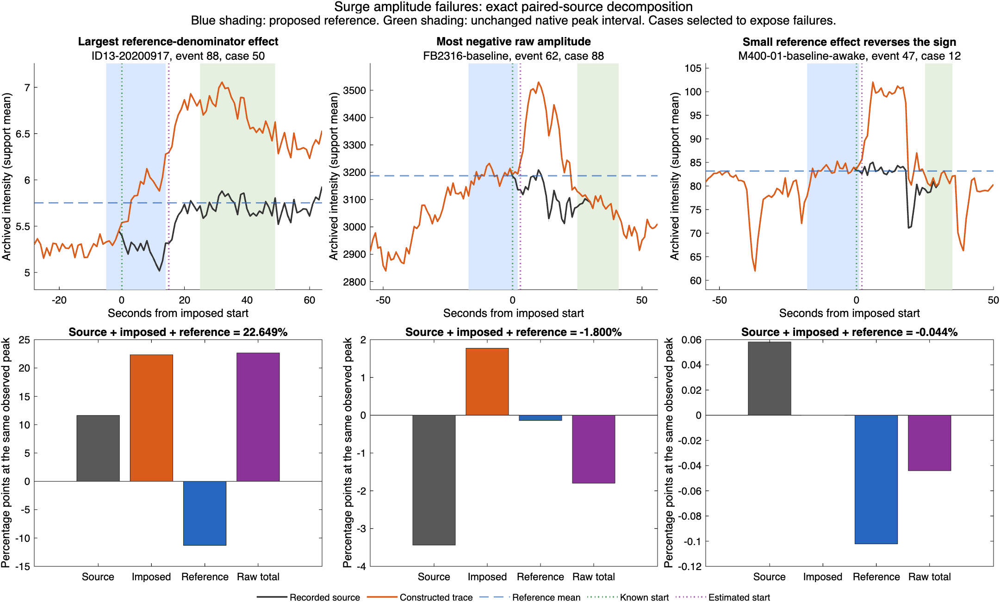

# Surge amplitude eligibility and the 89 flagged measurements

The signed arithmetic reproduces exactly. The failures concern the reference,
the measurement interval, and interpretation of a fitted positive component.
The new experimental check preserves signed diagnostics and makes a provisional
positive-surge amplitude unavailable when the raw baseline-relative change is
zero or negative. It does not remove detections or change production outputs.

The [protocol](../../SURGE_AMPLITUDE_ELIGIBILITY.md) defines necessary arithmetic
and direction conditions before this audit. It deliberately does not label a
positive result as fully validated or use construction truth in the eligibility
function. All onset decisions are frozen from the
[preceding selector experiment](../surge-model-selection-20260910/README.md).

## What the 18 negative cases mean

These are 18 constructed recipes on **nine event footprints**, not 18 independently
confirmed biological surges. Four cases are on development backgrounds (one M400
and three FB2312); fourteen are on FB2316 under ketamine/xylazine. ID13 has none.
All selected the pulse model. A positive pulse relative to a fitted sloping
background does not imply that the raw intensity exceeds the earlier baseline.

Exact paired-source decomposition separates two mechanisms:

- **15 cases:** the source fluctuation at the observed native-window peak
  outweighs the imposed increment. The raw change would remain negative even
  using the source-only reference on those same frames.
- **3 cases:** the source fluctuation plus imposed increment is positive, but
  the raised reference reverses the sign. Their reference contamination is
  below the previous one-percent diagnostic screen.

All eighteen recipes have a seven-second rise and a start 25 seconds before
native detection. Their prescribed envelope first reaches its maximum **19
seconds before the native interval starts**. The retained measurement interval
therefore samples a later part of the waveform. In three cases, no imposed
signal remains at the selected native-window maximum. Negative amplitudes range
from −1.800% to −0.0051% of the proposed reference.

This experiment deliberately reuses historical native intervals instead of
redetecting the constructed traces. These results expose the limits of the
measurement definition; they do not establish how often a current detector would
miss a spontaneous surge peak. Sign gating alone cannot solve that limitation.

## What the 71 contaminated references mean

All 71 cases above the one-percent imposed-reference screen retain a positive
raw change. Their estimated starts are 3–23 seconds late and their 20-second
references contain 3–20 samples of imposed signal. The largest contamination
is 9.21%, reducing the baseline-relative amplitude by 11.30 percentage points
against the source-only denominator on the same frames.

All 71 remain positive using either half of the reference separately. A rule
requiring positive amplitude under both halves would therefore flag **none of
these 71 cases**, while flagging five other positive recipes that do not exceed
the one-percent screen. Furthermore, 26 of the 71 contaminated references have
flat or falling half means: the source fluctuation can hide an imposed rise.
These observations concern this particular half-reference diagnostic, not every
possible baseline-stability test. No new threshold or exclusion is introduced.

## Implemented experimental measurement contract

`assessSurgeAmplitudeEligibility` receives only the observed trace, native
interval, sampling rate, both-sign overlap mask, and frozen onset/status.

1. Require a resolved onset and a complete contiguous 20-second reference before
   that onset, ending before native detection, with no retained overlapping event.
2. Require finite reference/native samples and a finite, positive reference mean.
3. Compute and preserve `SignedRawAmplitude = max(Y_native)/mean(Y_reference)-1`.
4. For negative changes return `raw_direction_conflict`; for zero return
   `no_positive_raw_change`. Both leave `ProvisionalPositiveAmplitude` as NaN.
5. For positive changes return `positive_raw_change_provisional` with the same
   signed value. `PositiveAmplitudeEligible` indicates only these necessary
   arithmetic/direction conditions, not proof of a clean reference or true surge.

Missing-reference and unresolved-onset states remain explicit. The function
also exports the first/second reference-half means, their relative change and
the amplitudes under each half. It does not select the most favorable reference,
change the native interval, take an absolute value or replace the raw measurement
with a positive model coefficient. Source/recipe truth is confined to separate
`Oracle...` audit fields and never determines eligibility.

## Full-panel results

Replay 36 recipes on each of 308 fixed supports from six recordings, plus one
separate noiseless support. There are 11,124 planned recipe rows and 309 source
control rows: **11,433 rows total**. Of the recipes, 10,440 recorded-background
cases and 36 noiseless cases are constructible. The development cohort includes
the separately reported FB2411 fluorescence control. Raw TIFFs are not reread
here; previously independently verified trace caches are hashed and reused.

| Cohort | Constructible recipes | Arithmetic amplitudes | Positive provisional amplitudes | Negative direction conflicts | Positive cases above 1% reference screen |
|---|---:|---:|---:|---:|---:|
| Development, including fluorescence | 3,852 | 1,231 | 1,227 | 4 | 33 |
| Additional ID13 and FB2316 | 6,588 | 1,267 | 1,253 | 14 | 38 |
| Noiseless, separate | 36 | 36 | 36 | 0 | 0 |

The development source controls retain seven positive provisional amplitudes;
the additional controls retain thirteen. Other controls remain unresolved. These
controls can contain real physiology and are not biological negative labels.
Unavailable recipes and unresolved onsets are retained in the full table.

## Exact decomposition and examples

Let p be the first observed maximum within the unchanged native interval, Bx
the source-only reference mean and By the constructed reference mean. Then:

`Yp/By − 1 = (Xp/Bx − 1) + (Yp − Xp)/Bx + (Yp/By − Yp/Bx)`.

The right side is source fluctuation, imposed increment, and reference effect,
all at the same observed peak. Values below are percentage-point contributions.
These diagnostics require the paired unchanged source and cannot be calculated
as corrections for unknown spontaneous events.

| Review case | Source | Imposed | Reference effect | Raw total |
|---|---:|---:|---:|---:|
| 50: ID13 event 88, largest reference effect | +11.620 | +22.324 | −11.296 | +22.649% |
| 88: FB2316 event 62, most negative raw change | −3.435 | +1.774 | −0.139 | −1.800% |
| 12: M400 event 47, reference reverses sign | +0.0581 | 0 | −0.1022 | −0.0440% |

The figure deliberately selects failure examples; it is not a representative
performance sample. Review identifiers join the
[89-case decomposition](flagged-case-decomposition.csv) to the
[8,711 plotted trace samples](flagged-trace-samples.csv).

## Decision and next step

Keep the eligibility check and selector outside production while timing and
reference validity remain unresolved. The explicit raw-direction status prevents
a negative value being silently presented as a positive-surge amplitude, but
neither positive sign nor reference-half agreement establishes reportability.

Next compare the **estimated-onset-to-native-end** raw peak interval with the
current native-only interval, using a prespecified rule and both-sign neighboring
event exclusions. Test whether it recovers early imposed peaks without selecting
unrelated source peaks, including unchanged controls and adjacent-event challenges.
Report reference contamination alongside peak recovery; do not move the reference
to force a positive amplitude. This is a validation proposal, not an implemented
window expansion or a supported production correction.

Once the event interval and pre-rise reference can be justified together,
integrate one coherent measurement definition, advance its contract, complete
surge statistical parity, and rerun the cohort. Optical change remains distinct
from oxygen concentration; biological detection accuracy is still unestablished.

## Verification and reproducibility

- **175 MATLAB focused tests pass**, including eight new tests for negative/zero
  values, missing reference/native samples, overlap, reference sensitivity,
  gain invariance, peak ties and sampling-rate conversion. Repository checks
  inspect 407 MATLAB files and report 84 analyzer advisories, unchanged in count.
- **61 Python tests pass**, also under optimized execution; five are new.
- Independent Python reconstruction verifies every one of the 11,433 rows,
  all 89 flagged cases, and 2,534 constructed-case decompositions. It checks
  native peak selection, reference means, signed amplitudes, eligibility and
  reference-half diagnostics against MATLAB, retaining all frozen selector fields.
- All 407 MATLAB source hashes and ten input hashes are checked around the
  successful audit. The independent verifier rechecks inputs before and after
  reconstruction. No onset refits or detector/master/statistics reruns occur.
- An initial CSV import attempt encountered the noiseless support's intentionally
  empty cache path. Explicit missing-string handling was added before the full
  successful run; the failed attempt performed no measurement calculations.

From the repository root, add `tests/analysis` to the MATLAB path and run
`runSurgeAmplitudeEligibilityAudit(priorSelectorRoot,newOutputRoot)`. Then run
`verify_surge_amplitude_eligibility.py priorSelectorRoot newOutputRoot` with NumPy
and h5py (the imported prior verifier also requires Pillow). The
[diagnosis script](diagnosis-script.txt) reproduces the mechanism summary, and
the [plot script](plot-cases-script.txt) records its local output path.
Raw data and MAT caches remain outside GitHub.

See [all measurements](amplitude-eligibility-results.csv),
[eligibility/source/shape summaries](eligibility-summary.csv),
[status counts](status-summary.csv), [diagnosis counts](diagnosis-summary.json),
[completion](completion.json), [independent verification](independent-verification.json),
[MATLAB source hashes](code-manifest.csv), [other validation sources](validation-code-manifest.csv),
[input hashes](input-manifest.csv), and [artifact hashes](artifact-manifest.csv).

Saved logs retain startup and the existing redundant test-path warning; all tests
passed. Terminal control characters and trailing whitespace are removed from
logs, and CSV line endings are normalized to LF before artifact hashing.
