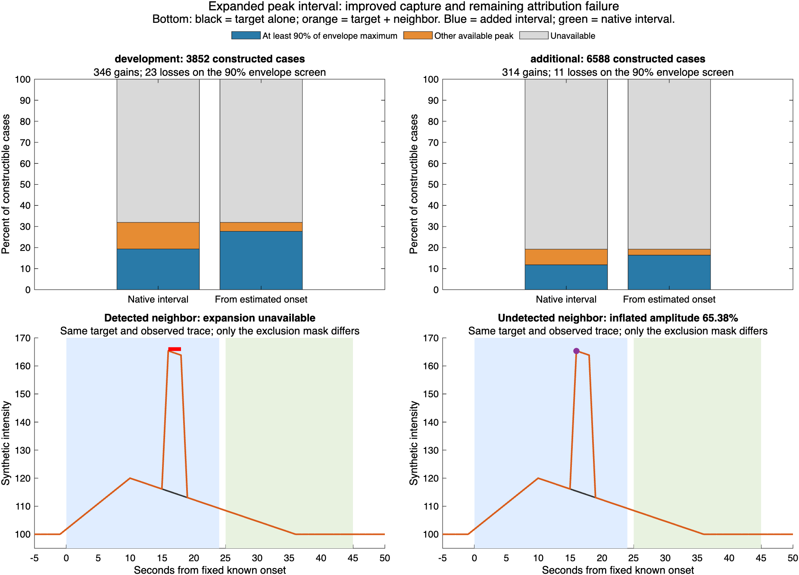

# Experimental peak interval from estimated onset through native end

The expanded interval captures the imposed surge peak more often and makes all
18 previously negative recipes positive. It also increases opportunities to
select background fluctuations. Keep this measurement experimental pending
full-movie validation with the existing detector. Production detection,
measurement, statistics and contract identities remain unchanged.

The [prespecified protocol](../../SURGE_EXPANDED_PEAK.md) keeps the same spatial
support, frozen onset, native end and 20-second reference. It adds only frames
between estimated onset and native start. Any detected overlap of either sign
or nonfinite sample in those added frames makes the expanded result unavailable;
it does not skip frames or silently substitute the native result. Signed native
and expanded amplitudes are exported separately.

## Scope and denominators

Reuse all 11,433 rows of the
[preceding amplitude audit](../surge-amplitude-eligibility-20260910/README.md):
11,124 planned recipes and 309 controls. There are 308 recorded event footprints
from six recordings and one separate noiseless support. Among the recipes,
10,440 recorded-background cases and 36 noiseless cases are constructible.
Only 2,498 recorded-background and 36 noiseless cases have the required resolved
onset and arithmetic/reference conditions. The unavailable rows remain present.
No onset is refitted and no detector is rerun on these constructed mean traces.

Development backgrounds are M400, M401, FB2312 and the separately reported FB2411
fluorescence control. Additional backgrounds are ID13 awake/mobile and FB2316
under ketamine/xylazine. Their original provenance and historical native-support
contracts remain in the preceding reports. Repeated recipes and footprints from
one recording are not independent biological samples.

## Peak capture, gains and losses

For constructed traces, score the imposed envelope at the observed maximum,
relative to the envelope maximum over the recording. The prespecified screen is
at least 90%. It measures which phase of the imposed waveform was sampled, not
accuracy of the raw amplitude or biological detection performance.

| Cohort | Constructible | Available under both intervals | Native peak meets 90% screen | Expanded peak meets screen | Gains | Losses |
|---|---:|---:|---:|---:|---:|---:|
| Development, including fluorescence | 3,852 | 1,231 | 744 | 1,067 | 346 | 23 |
| Additional ID13 and FB2316 | 6,588 | 1,267 | 776 | 1,079 | 314 | 11 |
| Noiseless, separate | 36 | 36 | 24 | 36 | 12 | 0 |

Across recorded backgrounds, capture increases **1,520 → 2,146 of 2,498 available
cases** (60.8% → 85.9%). On the full 10,440 constructible denominator, those counts
are 14.6% → 20.6%; expansion does not resolve missing onsets or references.
There are 660 gains and 34 losses. In **all 34 losses**, the new selected sample
has a higher source-only contribution and a lower imposed contribution than the
native-window sample. Five losses select less than half of the envelope maximum.
See [the complete loss list](near-peak-losses.csv).

| Source | Native meets screen | Expanded meets screen | Gains | Losses |
|---|---:|---:|---:|---:|
| M400-01-baseline-awake | 272 | 390 | 125 | 7 |
| M401-01-baseline-awake | 87 | 138 | 51 | 0 |
| FB2312-baseline-awake | 271 | 374 | 119 | 16 |
| FB2411 fluorescence control | 114 | 165 | 51 | 0 |
| ID13-20200917 | 345 | 477 | 134 | 2 |
| FB2316-baseline | 431 | 602 | 180 | 9 |

Recorded-background peaks entirely outside imposed support decrease from 48 to
five; there are no new outside-support selections or selections before the known
start in this panel. This does not exclude choosing a sample within imposed
support that is nevertheless dominated by the underlying source fluctuation.

All 18 previously negative cases become positive, with raw expanded amplitudes
0.887%–22.659%. Sixteen meet the 90% envelope screen. Their known early peaks
explain why the native-only measurement missed much of the imposed waveform;
positive sign alone still does not certify the resulting amplitude.

## Source controls and unchanged baseline limitations

The unchanged source controls retain seven available results among 115 development
supports and thirteen among 193 additional supports. Three development controls
and one additional control acquire a larger maximum solely because of the
expanded interval; the largest increases are 3.61 and 1.47 percentage points,
respectively. The flat control remains unresolved. These source controls may
contain real physiology and are not negative biological labels.

On the same expanded windows and reference frames as the constructed cases,
the paired source-only maximum increases in **1,256 of 2,498 available recorded
cases**. This diagnostic uses frozen imposed-case onset decisions, so it is
separate from independently resolved source controls. A larger measured amplitude
cannot by itself establish better recovery of the imposed event.

The reference frames and means do not change. All **71 cases above the one-percent
imposed-reference screen remain contaminated**. Reference effects are recomputed
at each new observed peak; the worst reduction remains 11.30 percentage points.
Noiseless peak capture reaches 36/36, but unchanged reference contamination means
this is not a claim of exact amplitudes in all noiseless cases.

## Neighbor and missing-data challenges

Eight deterministic traces isolate the interval rule with a supplied onset at
frame 75, native interval 100:120 and 1 Hz sampling. The target rises to 20% at
frame 85 and recovers by frame 111. Supplied masks test exclusion behavior; they
are not detector-produced labels. The onset estimator is not rerun in these
challenges, so its reaction to neighbors is untested here.

| Challenge | Expanded result |
|---|---|
| Clean early target | Peak frame 85; amplitude 20% |
| Detected positive neighbor in added interval | Unavailable: neighbor overlap |
| Detected negative neighbor in added interval | Unavailable: neighbor overlap |
| Undetected positive neighbor in added interval | Selects neighbor frame 91; amplitude **65.38%** |
| Undetected negative neighbor in added interval | Retains target peak frame 85; amplitude 20% |
| Neighbor in reference | Unavailable: overlapping reference |
| Neighbor before reference | Retains target peak frame 85; amplitude 20% |
| Nonfinite added sample | Unavailable: nonfinite added interval |

The positive neighbor contributes 50 intensity units for three samples. The
detected and undetected versions have identical observed traces; only their
supplied masks differ. This demonstrates a limit of using detected events as
exclusions, not an estimate of real-world interference frequency. In the recorded
panel, none of the otherwise available cases has a blocked added frame, because
the frozen onset fits already require contiguous clean context. Neighbor rejection
is therefore exercised by the explicit challenges, not demonstrated independently
across those recorded cases.

The cached union masks support pre-native overlap checking. They do not separate
other events from the event's own masks during the native interval. Native contact
handling remains the responsibility of the existing contact ledger and is not
revalidated in this experiment. Undetected neighbors remain an attribution risk.

## Decision and next step

Retain the expanded interval as a candidate measurement definition. It addresses
early-peak loss on frozen traces but does not solve reference contamination or
event attribution. Do not integrate it as the production default on this evidence.

Next run a prespecified **full-movie comparison using the existing detector**,
then apply the candidate onset and peak measurements to the actual newly detected
events. Include isolated early/slow surges, nearby positive/negative events,
overlap and unchanged source movies. Use known injected spatial/temporal masks
only for scoring; report missed/merged detections, onset availability, peak
capture, wrong-event selection and reference contamination separately. This will
test the complete chain with actual event intervals instead of relying on frozen
historical supports. It remains separate from the outsourced alternative detector.

After a supported measurement definition is integrated and its contract updated,
complete equivalent surge statistics and rerun the full cohort under one version.
No optical-to-oxygen concentration calibration or biological accuracy estimate
is established by the current experiment.

## Verification and reproduction

- **182 MATLAB focused tests pass**, including seven new peak-window checks.
  Repository checks inspect 410 MATLAB files with 84 analyzer advisories and pass
  the synthetic hypoxia-amyloid checks.
- **65 Python tests pass**, including four new checks, also under optimization.
- Independent Python reconstruction verifies all 11,433 rows, every frozen prior
  field, 2,534 expanded paired-source decompositions, eight neighbor challenges
  and their 1,280 trace samples. Both native and expanded arithmetic, added masks,
  peak ties, eligibility, envelope fractions and source-only gains are checked.
- All 410 MATLAB source hashes and eight input hashes remain unchanged across
  the successful audit. Independent verification rechecks inputs before and after
  reconstruction. Raw TIFFs are not reread; verified trace caches are reused.

Add `tests/analysis` to the MATLAB path and run
`runSurgeExpandedPeakAudit(selectorRoot,eligibilityRoot,newOutputRoot)`. Then run
`verify_surge_expanded_peak.py selectorRoot eligibilityRoot newOutputRoot` using
NumPy, h5py and Pillow. Exact input paths/hashes are in the input manifest.
The [diagnosis script](diagnosis-script.txt) reproduces the loss list and totals;
the [plot script](plot-comparison-script.txt) records the local output root.
Raw TIFFs and MAT caches remain outside GitHub.

Tables: [all results](expanded-peak-results.csv), [source/shape summaries](peak-summary.csv),
[source controls](source-controls.csv), [control summary](control-summary.csv),
[previous negative cases](previous-negative-cases.csv), [challenges](neighbor-challenges.csv),
[challenge traces](neighbor-challenge-traces.csv), and [status counts](status-summary.csv).
Provenance: [completion](completion.json), [independent verification](independent-verification.json),
[MATLAB sources](code-manifest.csv), [other validation sources](validation-code-manifest.csv),
[inputs](input-manifest.csv), and [artifact hashes](artifact-manifest.csv).

Saved logs retain the existing redundant test-path warning; all tests pass.
Terminal control characters and trailing whitespace are removed from logs,
and CSV line endings are normalized to LF before artifact hashing.
