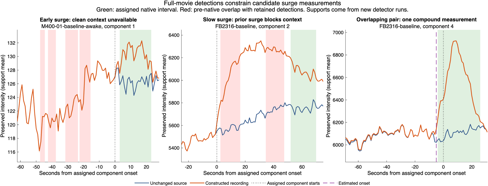

# Full-movie validation of candidate surge onset and peak measurement

The complete pipeline is substantially more restrictive than the preceding
frozen-trace tests. All ten imposed positive components intersect a retained
surge, but only eight receive unique geometric assignments and only two yield
candidate onsets/amplitudes. Both measurable cases select the same peak under
native and expanded intervals. **Do not promote the candidate measurement yet.**

This is a four-master-run experiment using unchanged production code and
parameters. Candidate onset/measurement fits run afterward on the newly detected
native supports; truth does not enter those estimators. No alternative detector,
manual labels, group statistics or production contract changes are involved.
See the [prespecified protocol](../../SURGE_FULL_MOVIE_MEASUREMENT.md).

## Recordings, construction and correspondence

Use complete cached DANDI 000891 release 0.240215.0831 recordings:

- **M400-01-baseline-awake:** 512×512×600, 1 Hz, 4.75 µm/pixel;
  asset `8ba82dc1-aaba-411d-a196-ff8ef0b61fc3`,
  `sub-ID400/sub-ID400_ses-M400-01-baseline-awake_image.nwb`,
  series `/acquisition/1hz_mcor.tif`.
- **FB2316-baseline:** 512×512×1,200, 1 Hz, 2.35 µm/pixel; KX anesthesia;
  asset `8426348c-f940-4214-8e13-90d086301091`,
  `sub-FB2316/sub-FB2316_ses-FB2316-baseline_image.nwb`,
  series `/acquisition/01_FB2316_bin2_950ms_2x_1Hz.tif`.

Each has an unchanged control and one composite challenge. A target disk and
overlapping neighbor disk each have radius 85.5 µm, with centers separated by
approximately one radius. Positions are selected from the control's common
sink/surge tissue eligibility mask, requiring at least 95% eligible pixels in
both disks. No challenge detection is used for placement.

Each challenge has six components: an early quadratic surge starting at frame
101, a slow gamma surge at 201, overlapping positive components at 401/409, and
a positive/negative pair at 501/509. All absolute prescribed peaks are 20%.
There are five positive components and one negative component per movie.
Components share normalization and are not independent experimental replicates.
There are only two original recordings; this is a development comparison, not
untouched evaluation or a biological condition comparison.

Fractional components add before multiplying source pixels. Clipping is rejected;
integer rounding is tracked separately. No noise is added. Controls retain
identical source pixels and are evaluated at the same potential locations/windows.
They have no imposed truth and cannot be treated as biological negative labels.

Every event/component native space-time intersection and IoU is exported for
both signs. Same-sign positive-IoU pairs are assigned greedily in decreasing IoU,
at most once per component/event, with deterministic tie breaks. This defines a
correspondence, not a threshold for successful recovery. Multiple intersections,
shared events and unassigned components remain visible.

## Actual detector outputs

| Recording | Input | Surge events | Surge sites | Sink events | Sink sites | Master runtime |
|---|---|---:|---:|---:|---:|---:|
| M400 awake | Control | 50 | 41 | 196 | 56 | 45.5 s |
| M400 awake | Challenge | 52 | 43 | 189 | 50 | 52.5 s |
| FB2316 KX | Control | 31 | 27 | 311 | 79 | 84.5 s |
| FB2316 KX | Challenge | 34 | 25 | 239 | 63 | 72.9 s |

These are complete-recording counts; their differences are not counts of
successfully recovered injected events. The net sink decrease in FB2316, for
example, cannot be interpreted as 72 correctly removed or missed biological
events. Local additions influence the processing of the complete movie.

Tissue eligibility also changes after construction. In M400, the target disk
falls from **95.14% to 87.81%** eligible, and the neighbor from 95.04% to 91.38%.
In FB2316, they change from 99.95%/99.98% to 99.02%/99.38%. The placement rule
passes on controls, but eligibility is not constant across the comparison.
These changes are reported rather than repaired by selecting a new location.

## Imposed components and candidate measurements

Across the two challenge movies:

- All **10 positive components** have a same-sign native intersection.
- **8** receive unique event assignments. In each overlapping positive pair,
  one retained surge intersects both components; that event is assigned once.
- **6 of 8 assigned surges** lack sufficient clean fitting context.
- **2 assigned surges** resolve, both in FB2316. Their native and expanded
  intervals select the same peak, at the imposed component's envelope maximum.
- Both negative components receive sink assignments. Candidate sink onset/peak
  changes are outside this experiment; their production amplitudes are audited.

| Positive component | M400 result | FB2316 result |
|---|---|---|
| Isolated early | Assigned; context unavailable | Assigned; context unavailable |
| Isolated slow | Assigned; context unavailable | Three intersecting surges; assigned event lacks context |
| Target in positive pair | Assigned shared event; context unavailable | Shared event assigned to neighbor |
| Positive neighbor | Shared event assigned to target | Resolved shared event |
| Target in negative pair | Assigned; context unavailable | Resolved |

The two resolved measurements are:

| Assigned FB2316 component | Estimated onset | Error relative to assigned component | Peak frame, both intervals | Candidate raw amplitude | Positive reference contamination |
|---|---:|---:|---:|---:|---:|
| Positive neighbor, component 4 | 404 | −5 s | 418 | 13.455% | 0.08760% |
| Target in negative pair, component 5 | 503 | +2 s | 508 | 12.706% | 0.06834% |

The first is a compound positive event: the assigned neighbor begins at 409,
but the other positive component begins at 401. Its onset error cannot be
interpreted as error against a single isolated event. Its amplitude includes
both positive contributions on the detected fixed footprint. The second peak
precedes the negative neighbor's start at 509. Neither candidate has a perfectly
uncontaminated reference, even though both fractions are below 1%.

Across all retained surges, including events unrelated to the prescribed
components, onsets resolve for 5/50 and 5/52 M400 control/challenge events and
3/31 and 3/34 FB2316 events. All **167 retained surges** are evaluated, not only
the assigned ones. The 16 resolutions must not be described as 16 recovered
injected events. Unchanged source controls already contain potential geometric
overlaps: M400's positive-pair windows and FB2316's slow/negative windows.

## Why the six assigned measurements are unavailable

The latest pre-native blocking masks leave **0, 0, 4, 15, 18 and 18 contiguous
frames** before native detection. The estimator cannot establish its required
20-second pre-onset reference. Five latest blockers are retained sinks; one is
a retained surge fragment inside the imposed slow pulse.

| Recording/component | Native starts | Last blocked frame | Clear pre-native frames | Latest blocker |
|---|---:|---:|---:|---|
| M400 early | 104 | 85 | 18 | Sink, frames 79–85 |
| M400 slow | 215 | 214 | 0 | Sink, frames 208–215 |
| M400 positive-pair target | 405 | 389 | 15 | Sink, frames 354–389 |
| M400 negative-pair target | 504 | 503 | 0 | Sink, frames 490–510 |
| FB2316 early | 104 | 85 | 18 | Sink, frames 83–85 |
| FB2316 slow | 253 | 248 | 4 | Surge, frames 236–248 |

FB2316's slow assigned event begins 52 seconds after the imposed start; that
start is also outside the candidate estimator's 40-second backward search bound.
Its earlier retained surge overlaps the same imposed pulse. Removing that
exclusion alone would therefore not establish the true onset.

The [paired-control mask comparison](context-blockers-control-comparison.csv)
finds no same-sign control mask at the shared blocking pixels for five of these
six cases. M400's negative-pair blocker is fully covered by control sink masks
at those pixels. These are pixel/time comparisons, not proof of event identity.

For **both early-surges**, the sink exclusions at frame 85 are absent at those
same pixels in the unchanged controls. Movie pixels are identical through frame
100; the first imposed signal begins at 101. Thus later changes in a recording
can alter earlier detected masks through the complete processing pipeline.
This establishes processing sensitivity, not which stage is responsible or
whether the underlying source fluctuation is biological. Two other new blockers
intersect the imposed slow pulse or its tail. The finite surrogate tail is also
part of the challenge and must not be mistaken for a physiological assumption.

## Decision and next step

Keep the candidate onset/expanded-peak path outside production. The full-movie
test does not confirm its earlier frozen-trace gains, and the present reference
requirements correctly preserve unavailable measurements instead of forcing a
baseline. Geometric intersections and two measurable compound/neighbor cases
are insufficient evidence for production promotion.

Next trace the **six blocked cases** through raw intensity, cubic detrending,
spatial/temporal normalization, candidate selection and retained masks. Prioritize
the two new pre-onset sink exclusions at frame 85, where raw inputs are unchanged,
and the fragmented FB2316 slow surge. Distinguish source activity, effects of
the imposed waveform/tail, and processing-induced changes before proposing an
exclusion or grouping correction. Do not weaken the baseline rule merely to
increase the number of amplitudes. Also investigate tissue-mask changes before
claiming stable spatial exposure across conditions.

Only after a supported event/reference definition is integrated should surge
statistical parity and a complete cohort reanalysis use a new frozen contract.
No sensitivity/specificity estimate, oxygen-concentration calibration or depth
claim follows from these constructed recordings.

## Verification and reproducibility

- **185 MATLAB focused tests pass**, including three new geometry/recipe tests.
  Repository checks inspect 414 MATLAB files and report 85 analyzer advisories;
  the single new advisory is indentation alignment, retained in the report.
- **68 Python tests pass**, including three new construction/placement tests,
  also under optimized execution.
- Independent reconstruction verifies **943,718,400 movie pixel samples**,
  including unchanged controls and exact rounded constructions. It checks
  control-only placement, source hashes, all six component waveforms and geometry.
- Independently verify **1,030,200 source/observed support-frame pairs**,
  component contributions, exported native mask unions, **334 component fits**,
  all 167 candidate measurements, **6,612 event/component pairs**, all 24
  component summaries and **1,102 production amplitude/status records** for both signs.
- MATLAB checks source event/native-run joins; Python independently checks the
  exported masks/unions and calculations, not every original MATLAB table encoding.
  Eight challenge-event decompositions are verified; only two belong to assigned
  positive components. Source-only controls do not receive imposed-truth diagnostics.
- The MATLAB source and original input hashes remain frozen across the four
  successful runs. Per-recording provenance binds raw inputs, master outputs and
  measurement caches. Independent verification rechecks those hashes. Each case also
  retains `candidate-measurement/analysis-settings.json`, exported from its master
  output. Control/challenge analysis settings are identical within each recording.

Run `runSurgeFullMovieMeasurement(referenceRoot,newOutputRoot)` after adding
`tests/analysis` to the MATLAB path. Then run
`verify_surge_full_movie.py newOutputRoot` with NumPy, h5py and Pillow.
The [diagnosis script](diagnosis-script.txt) aggregates assigned traces and compares
blocking pixels with controls; [the plot script](plot-traces-script.txt) records
its local output path. The [settings export script](export-settings-script.txt)
records extraction of the actual run settings. Full runtime folders occupy approximately 9.1 GiB locally;
raw movies, caches and master MAT outputs are not committed to GitHub.

Tables: [recording counts/runtimes](recording-summary.csv), [all components](component-summary.csv),
[all candidate measurements](all-candidate-measurements.csv), [context blockers](context-blockers.csv),
[trace samples](assigned-trace-samples.csv), and [diagnosis totals](diagnosis-summary.json).
Each recording/case subfolder retains its recipe, production-amplitude audit,
event/component pairs, candidate measurements and provenance.
Receipts: [completion](completion.json), [independent summary](independent-verification.json),
[per-recording verification](independent-recording-verification.csv),
[MATLAB sources](code-manifest.csv), [other validation sources](validation-code-manifest.csv),
[inputs](input-manifest.csv), and [artifact hashes](artifact-manifest.csv).

Committed text artifacts use LF line endings. Captured logs have terminal backspace
characters and trailing whitespace removed; warning text is retained.
