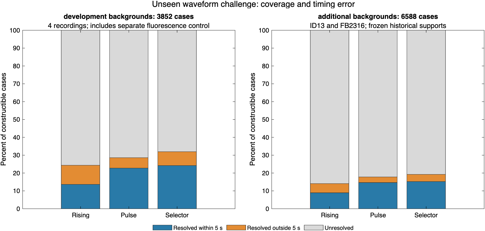

# Experimental onset-model selection and unseen waveform validation

The prespecified selector increases the number of estimates within five seconds
of a known imposed start, including on two additional DANDI recordings. It also
introduces losses, resolves more unchanged source controls than the pulse fit,
and retains baseline/amplitude failures. **Keep it experimental.** Production
detection, baselines, amplitudes, statistics and contract identities are unchanged.

The [protocol](../../SURGE_MODEL_SELECTION.md) specifies the rule before these
evaluations. Compare complexity-adjusted scores with an additional two-family
penalty; retain uncertainty when competitive models disagree. Copy the accepted
model's raw baseline and signed amplitude without averaging or maximizing them.
The score/profile thresholds are diagnostics, not calibrated statistical evidence.

## Recordings and units of analysis

There are **six source recordings**, not thousands of independent recordings or
biological events. Development backgrounds comprise 115 frozen event supports:
M400-01-baseline-awake (51), M401-01-baseline-awake (12), FB2312-baseline-awake
(40), and the separate FB2411 fluorescence control (12). The additional recordings
contribute 193 supports. Each support is the fixed spatial union of one historical
event's native masks; several supports can belong to the same recurring site.

| Additional session | Condition | Frozen event supports | Historical sites | Frames | Sampling |
|---|---|---:|---:|---:|---|
| ID13-20200917 | Awake and mobile | 131 | 34 | 1,200 | 1 Hz; 2.38 µm/pixel |
| FB2316-baseline | Ketamine/xylazine anesthesia | 62 | 32 | 1,200 | 1 Hz; 2.35 µm/pixel |

Both additional recordings belong to DANDI 000891, release 0.240215.0831:

- ID13: asset `eccd66bb-845e-4564-9983-3b167eaf9e15`,
  `sub-ID13/sub-ID13_ses-ID13-20200917_image.nwb`, series
  `/acquisition/ID_13_1_mcor.tif`.
- FB2316: asset `8426348c-f940-4214-8e13-90d086301091`,
  `sub-FB2316/sub-FB2316_ses-FB2316-baseline_image.nwb`, series
  `/acquisition/01_FB2316_bin2_950ms_2x_1Hz.tif`.

Their saved detector/measurement identities are `existing-v2-sd-1` and
`event-footprint-local-timing-2`, with statistics `mouse-strict-3` and normalization
`spatial-sd_then_temporal-sd`. They were previous pipeline references but had not
been used to develop these onset fits. This experiment extracts their original
TIFF mean traces on frozen supports; it does **not** rerun the current detector,
upgrade those historical outputs, or pool historical measurements with production
statistics. Native mask unions and exclusions retain both event signs.
See [ID13 provenance](additional-backgrounds/ID13-20200917/provenance.json) and
[FB2316 provenance](additional-backgrounds/FB2316-baseline/provenance.json).

## Frozen familiar-waveform replay

Replay the selector on previously verified outputs, without refitting either
component: 5,520 planned cases, **5,136 constructible cases**, and 115 source
controls. All rows share that constructible denominator.

| Method | Resolved | Within 5 s | Within 5 s and baseline imposed fraction ≤1% | Same onset as source control |
|---|---:|---:|---:|---:|
| Available-context rising | 1,303 | 856 | 856 | 103 |
| Pulse | 1,337 | 1,056 | 1,051 | 28 |
| Selector | 1,556 | 1,171 | 1,167 | 100 |

Relative to pulse, the selector gains 158 within-tolerance cases and loses 43.
The within-tolerance fraction among resolutions falls from 79.0% to 75.3%.
Source-control resolutions rise from four to seven. The selector still cannot
resolve the 2,208 constructed cases without sufficient clean fitting context.
See [method summary](cached-method-summary.csv) and
[paired transitions](pulse-selection-transitions.csv).

## New waveform panel

Apply gamma, exponential and asymmetric quadratic envelopes outside the fitting
library, crossed with 2/10/20% optical increments, rise scales 7/23 seconds and
onset delays 10/25 seconds: **36 recipes per support**. Construct
`Y = X * (1 + amplitude * envelope)` in double precision. Add no new noise,
clipping or rounding. Keep the native peak window and spatial support fixed.

The 308 recorded-background supports produce 11,088 planned cases, of which
**10,440 are constructible**. Retain 648 unavailable recipes explicitly.
Separately evaluate 36 recipes on one noiseless flat support. Three methods per
case produce 33,372 result rows; this is not an event or sample count. There are
308 unchanged source controls and one flat control, each evaluated three ways.

| Cohort | Method | Constructible | Resolved | Within 5 s | Within 5 s and baseline ≤1% |
|---|---|---:|---:|---:|---:|
| Development, including fluorescence | Rising | 3,852 | 938 | 525 | 522 |
| Development, including fluorescence | Pulse | 3,852 | 1,102 | 877 | 870 |
| Development, including fluorescence | Selector | 3,852 | 1,231 | 932 | 926 |
| Additional recordings | Rising | 6,588 | 928 | 589 | 589 |
| Additional recordings | Pulse | 6,588 | 1,173 | 966 | 961 |
| Additional recordings | Selector | 6,588 | 1,267 | 1,004 | 1,001 |
| Noiseless, separate | Rising | 36 | 27 | 18 | 18 |
| Noiseless, separate | Pulse | 36 | 36 | 33 | 33 |
| Noiseless, separate | Selector | 36 | 36 | 33 | 33 |

The additional-recording selector total represents 15.2% of constructible cases;
among its 1,267 resolutions, 79.2% are within tolerance, compared with 82.4% for
pulse. It gains 84 within-tolerance cases and loses 46. Missing clean context
accounts for 3,780 additional-recording cases and 1,656 development cases.
Model disagreement/uncertainty, inadequate evidence and unresolved best models
are retained explicitly in [all result rows](unseen-results.csv).

| Source | Constructible | Rising within 5 s | Pulse within 5 s | Selector within 5 s |
|---|---:|---:|---:|---:|
| M400-01-baseline-awake | 1,728 | 160 | 238 | 264 |
| M401-01-baseline-awake | 432 | 72 | 127 | 138 |
| FB2312-baseline-awake | 1,314 | 210 | 364 | 384 |
| FB2411 fluorescence control | 378 | 83 | 148 | 146 |
| ID13-20200917 | 4,356 | 258 | 424 | 451 |
| FB2316-baseline | 2,232 | 331 | 542 | 553 |

On unchanged source controls, rising/pulse/selector resolve 7/4/7 of the 115
development supports and 10/7/13 of the 193 additional supports. These traces
may contain real physiology and were chosen from historical detections; these
counts are **not false-positive rates**. The flat control remains unresolved.
The source-control response tempers interpretation of increased coverage.

The pulse and selector are six seconds late on three noiseless recipes:
quadratic rise 23 seconds, delay 25 seconds, at all three amplitudes. Their
baseline imposed fractions are 0.0172%, 0.0860% and 0.1720%. Unlike the earlier
48 in-family recipes with exact starts, this panel exposes model-shape error
even without measurement noise. No rule was retuned to those outcomes.

## Baseline and amplitude failures

Of the 1,231 development selector resolutions, 33 exceed the one-percent imposed
baseline screen and four have negative raw provisional amplitudes. Of the 1,267
additional resolutions, 38 exceed that screen and 14 have negative amplitudes.
The two groups do not overlap: **71 baseline-contamination cases and 18 negative
amplitude cases**, listed in [the 89-row review file](resolved-measurement-review.csv).
All 18 negative-amplitude cases select the pulse model. Do not convert their
amplitudes to absolute values or substitute the fitted positive component.

Additional-recording contamination reaches 9.21% of the source-only reference;
the largest baseline-induced amplitude decrease is 11.30 percentage points,
calculated at the same native peak relative to the source-only baseline on the
same frames. Development maxima are 5.26% and 6.12 percentage points. These are
paired-source diagnostics available in constructed data, not corrections that
can be calculated for unknown spontaneous events. A `resolved` onset and
`provisional_valid` reference do not establish amplitude reportability.

## Decision and dependency order

1. Inspect the 89 listed measurements and distinguish reference contamination
   from disagreement between a positive fitted component and a negative raw
   baseline-relative change. Define which amplitude is the intended scientific
   quantity and which conditions make it unavailable; preserve signed diagnostics.
2. Test that definition on the full panel, including all exclusions, source
   controls and waveform-specific losses. Further stress tests should cover
   background drift and acquisition noise. These recordings can no longer be
   called untouched evaluation data after using their failures for development.
3. Integrate only a supported timing/reference rule, update contracts and then
   complete equivalent surge recording/window and equal-mouse summaries. Finally
   rerun the complete cohort under one frozen contract.

This work tests measurement on fixed mean traces. It does not test spatial
detection/tracking, recover peaks outside the native interval, establish depth,
convert optical change into oxygen concentration, or establish biological
sensitivity/specificity. Archived intensity preparation and acquisition-dependent
noise remain limitations; no manually reviewed event labels are available.

## Verification and reproduction

- **167 MATLAB focused tests pass**, including 12 new selector test functions
  and four waveform test functions. Repository checks inspect 404 MATLAB files
  and pass synthetic hypoxia-amyloid checks. There are 84 analyzer advisories;
  [new-file advisories](new-analyzer-advisories.json) are retained for inspection.
  One existing test setup emits a redundant relative-path warning; its seven
  tests pass. The saved log retains the warning text with terminal control
  characters and trailing whitespace removed.
- **56 Python tests pass**, including eight new selector/waveform tests, under
  both ordinary and optimized execution.
- Independent Python/NumPy reconstruction verifies 5,520 cached selector rows,
  their 115 controls, all 33,372 new rows, and 21,570 component fits including
  controls. It checks both model fits, selection decisions and baseline/amplitude
  arithmetic, rather than checking only aggregate counts.
- Independently read both additional TIFFs and reconstruct all 231,600 raw
  support-frame means. Verify 193 exported native mask unions against fixed
  supports. This does not independently decode every original MATLAB table join
  or re-read archive NWB pixels; original conversion provenance is retained.
- All 404 MATLAB source hashes and 19 input hashes remain unchanged across the
  successful run. The input manifest includes two newly generated, then frozen
  trace caches. Python independently rechecks input hashes. No new detector,
  master or statistics run occurred in this experiment.

Tables: [backgrounds](backgrounds.csv), [source summary](unseen-source-summary.csv),
[shape summary](unseen-shape-summary.csv), [recipe summary](unseen-recipe-summary.csv),
[controls](unseen-controls.csv), [control summary](unseen-control-summary.csv).
Provenance: [completion](completion.json), [independent checks](independent-verification.json),
[MATLAB sources](code-manifest.csv), [other validation sources](validation-code-manifest.csv),
[inputs](input-manifest.csv), and [artifact hashes](artifact-manifest.csv).

From the repository root, add `tests/analysis` to the MATLAB path and call
`runSurgeModelSelectionValidation(cacheRoot,priorRoot,pulseRoot,referenceRoot,newOutputRoot)`.
Here `cacheRoot` is the amplitude-support cache, `priorRoot` the available-context
trace panel, `pulseRoot` the pulse panel, and `referenceRoot` the historical
local-timing recording reruns; exact paths/hashes are in the input manifest.
Then run `verify_surge_model_selection.py priorRoot pulseRoot newOutputRoot` with
NumPy, h5py and Pillow available. Run [postprocessing](postprocess-script.txt)
with Python and the output directory argument to reproduce the review filter
and paired transitions (expects the preceding pulse panel in a sibling directory).
The [plot script](plot-comparison-script.txt) records its local output root.
Raw TIFFs and MAT caches remain outside GitHub; compact tables and receipts are
committed. Text CSVs are normalized to LF before artifact hashing.
