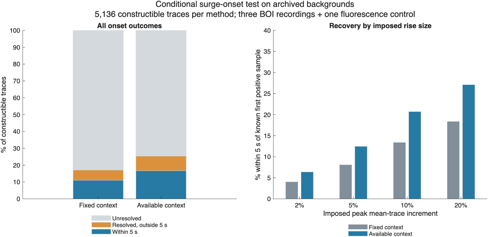

# Surge onset trace panel: context helps, fit model remains limited

Using the available contiguous clean context improves conditional onset
recovery, but the method is not ready to define production amplitudes.
All production detection, event identities, spatial support, timing, baselines,
amplitudes and statistics remain unchanged. The new context option is confined
to the experimental helper; its default still uses the previous fixed context.

## What was tested

The [prespecified protocol](../../SURGE_ONSET_TRACE_PANEL.md) uses 115 fixed
full-event supports from the growing-case caches: ID400 (51), ID401 (12), FB2312
(40) and the separate FB2411 fluorescence control (12). Backgrounds are the
original source traces, not the previously injected traces. Their support and
native intervals were selected in the earlier movie experiment, so these are
reused, detection-conditioned samples, not independent or held-out recordings.

Cross four peak mean-trace increments (2/5/10/20%), three rise lengths
(5/15/30 seconds), two rise shapes (linear/sine-squared), and two delays between
the first positive sample and native start (10/25 seconds). Both shapes plateau
for 20 seconds and then recover over the rise length. This yields 48 recipes
per support and 5,520 planned traces. Of these, 384 lack the required complete
20-second known pre-onset reference and remain explicitly construction-unavailable.

The remaining **5,136 constructed traces** receive both methods: **10,272
constructed fits**, plus **230 unchanged-source fits** (115 per method).
The 11,040-row result ledger includes unavailable cases for both methods.
There are **four source recordings**, not thousands of new movies or animals.
No detection, full-master or statistics run was repeated.

The only primary algorithm change is to start the fit after the latest
preceding overlapping detection, or at the recording start if necessary,
while retaining a contiguous 20-second proposed reference and an interior
onset candidate. Search bounds, waveform model, thresholds, fixed spatial
support and native peak interval are otherwise identical. Detection exclusions
are inherited from the prior growing movies for both methods and controls;
they were not redetected after each new trace construction.

## Main comparison

All fractions below use the **same 5,136 constructible traces per method**.
The aggregate is an engineering comparison including the fluorescence control,
not a pooled biological result.

| Outcome | Fixed context | Available clean context |
|---|---:|---:|
| Resolved onset | 878 (17.1%) | 1,303 (25.4%) |
| Within five seconds of known first positive sample | 564 (11.0%) | 856 (16.7%) |
| Resolved, but outside that tolerance | 314 | 447 |
| Resolved with <=1% imposed contribution in proposed baseline | 856 | 1,259 |
| Within five seconds **and** <=1% imposed baseline contribution | 564 | 856 |
| Median absolute error among resolved estimates | 4 s | 4 s |
| 90th percentile absolute error among resolved estimates | 14 s | 13 s |

All 878 fixed-rule resolutions retain identical onset and provisional
amplitude under the new option. Available context adds 425 resolutions, of
which 292 fall within five seconds. It does not trade away existing resolutions
in this panel. Nonetheless, only 65.7% of its resolved cases fall within that
tolerance; reporting that percentage alone would hide the many unresolved cases.
The five-second and one-percent cutoffs are descriptive development screens,
not validated physiological or publication-quality thresholds.

### Source strata remain separate

| Background | Constructible traces per method | Within five seconds: fixed | Within five seconds: available |
|---|---:|---:|---:|
| ID400 BOI | 2,304 | 165 (7.2%) | 253 (11.0%) |
| ID401 BOI | 576 | 63 (10.9%) | 110 (19.1%) |
| FB2312 BOI | 1,752 | 226 (12.9%) | 317 (18.1%) |
| FB2411 fluorescence control | 504 | 110 (21.8%) | 176 (34.9%) |

Across the three BOI backgrounds alone the corresponding counts are
454/4,632 (9.8%) and 680/4,632 (14.7%). The fluorescence result is a response
to artificial mean-trace pulses on that background, not oxygen-event detection.

### What still prevents reliable measurement

Available context leaves 2,208 constructible cases with insufficient clean
context. Other unresolved outcomes are 1,101 insufficient fit improvements,
400 changes that do not meet the rising-slope rule, 86 search-boundary optima
and 38 broad profiles. Missing reference information is not repaired by fitting
through an excluded event or borrowing distant baseline frames.

Recovery depends strongly on imposed rise size. Under the available-context
rule, estimates within five seconds account for 6.4%, 12.5%, 20.7% and 27.1%
of constructible cases at 2%, 5%, 10% and 20% respectively. Ten-second native
delay gives 21.8%, versus 11.4% for 25-second delay. Five-second rises perform
worse than 15-second rises. These are marginal comparisons over the other
prespecified factors, not independent sample proportions.

Among the 1,303 available-context resolutions, the median imposed contribution
in the native baseline is 3.26%, compared with zero in the proposed baseline.
This conditional improvement does not resolve the tail of failures: proposed
baseline contamination reaches 9.04%, with a worst baseline-induced amplitude
reduction of 11.60 percentage points relative to the same-frame source-reference
diagnostic. Errors span 29 seconds early to 23 seconds late. A clean imposed
baseline can simply reflect a very early estimate; source drift remains in
the measured optical amplitude.

The unchanged-source controls resolve 4/115 times with fixed context and 7/115
with available context. Among constructed resolutions, 73 and 103 respectively
have exactly the same onset as their paired source control. These controls
can contain physiology and were selected through earlier detections; neither
count is a biological false-positive rate.

## Separate post-hoc noiseless calibration

After inspecting the panel, 96 additional fits tested the same 48 recipes and
two methods on a constant signal of 100, with native interval 120:180 and no
neighbor exclusions. This was **not part of the prespecified panel**, is not
included in its totals, and did not change either algorithm or its thresholds.

Both methods resolve 40/48 recipes within five seconds. Both reject all eight
recipes with a five-second rise and a 25-second native delay (four amplitudes,
two shapes): by the end of the fitting window the pulse has already plateaued
and begun to recover. The selected broken-line change fails the rising-slope
rule even though a positive pulse is present. The failure therefore occurs
without noise or overlapping activity. Other noiseless estimates can still
lead or lag the first positive sample by several seconds.

This identifies a model limitation independent of the archived background.
It supports testing a model that allows rise, plateau and recovery. It does
not show that such a model can recover onset in the many cases lacking a
usable pre-event reference.

## Decision and next step

Retain available contiguous context as the experimental comparison option;
do not promote either onset rule into production. Next implement a candidate
measurement fit allowing a rise, plateau and recovery. First establish its
noiseless behavior, then compare on this same frozen panel using identical
exclusions and denominators. Require joint improvement in onset error and
baseline contamination, and inspect paired source changes. New held-out
recordings are still needed before freezing a publication measurement rule.

These are deterministic optical mean-trace increments. They do not add photon
noise, model spatial dilution, estimate oxygen concentration, test candidate
admission, or measure movie detection sensitivity. No conclusion about biological
detection accuracy follows from this panel.

## Verification and artifacts

- **145 MATLAB focused tests pass**, including ten new tests of available context,
  recording/neighbor limits, missing data, unchanged default behavior and pulse
  construction. Repository checks inspect 395 MATLAB files, report the same 74
  analyzer advisories as before, and pass the hypoxia-amyloid synthetic checks.
- **42 Python tests pass**, including eight new checks; all pass with `-O` too.
  Tests check missingness, pulse support, denominator effects, summary
  denominators and rejection of deliberately changed output flags.
- Independent NumPy construction and fits verify every planned result row,
  all 10,272 constructed fits, 230 source fits and the separate 96 noiseless
  fits. Mask-based exclusions are rebuilt from the frozen cache. No source
  subtraction or known onset enters either fitted estimator.
- The MATLAB code and 12 cached input files remain unchanged during the panel.
  Source and artifact hashes accompany the report; historical reports retain
  their original hashes and refer to their original code revisions.

Tables: [method summary](method-summary.csv), [source summary](source-summary.csv),
[recipe summary](recipe-summary.csv), [source-by-recipe summary](source-recipe-summary.csv),
[all constructed rows](panel-results.csv), [controls](source-controls.csv),
[backgrounds](backgrounds.csv), [status counts](status-summary.csv),
[control status counts](control-status-summary.csv), and
[separate flat calibration](flat-calibration.csv).

Provenance: [completion](completion.json),
[independent verification](independent-verification.json),
[MATLAB code](code-manifest.csv), [other validation code](validation-code-manifest.csv),
[cached inputs](input-manifest.csv), and [artifact checksums](artifact-manifest.csv).
The executed post-hoc and plotting scripts are preserved as
[calibration text](flat-calibration-script.txt) and [plot text](plot-panel-script.txt).

To rerun from the repository root, add `tests/analysis` to the MATLAB path and
call `runSurgeOnsetTracePanel(cacheRoot,newOutputRoot)` with the previous amplitude
cache and a new output directory. Run the calibration script with its output
path adjusted, then run `verify_surge_onset_trace_panel.py cacheRoot newOutputRoot`
using Python with NumPy, h5py and Pillow. Summaries are generated after successful
independent verification. Raw TIFFs and MAT caches are not committed.
