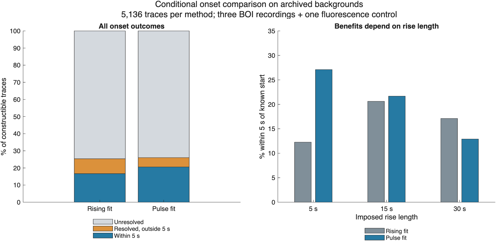

# Pulse-shaped onset fit: improved short-rise recovery, with tradeoffs

The experimental pulse fit improves overall timing on the frozen development
panel and fixes the noiseless short-rise failure. It also loses some previously
usable slow-rise estimates. It is therefore retained as an experimental option;
production detection, event/site identities, timing, baselines, amplitudes and
statistics remain unchanged. The previous experimental fit remains available.

## Method and scope

The [specification](../../SURGE_PULSE_ONSET.md) was written before evaluation.
The model fits a linear background plus a nonnegative pulse that can rise,
plateau and recover. Rise and recovery lengths vary independently; two waveform
families and a fixed duration grid are profiled at every candidate onset.
The available clean context, 20-second raw reference, 40-second onset search,
four-second lookahead, full spatial support and native peak interval are retained.
The pulse model uses a larger, explicitly documented complexity penalty.

For numerical conditioning, the fit divides the local trace by its median
absolute intensity. The score compares residual sums of squares on that same
scale. Provisional amplitude still uses the original raw native peak and the
raw proposed prebaseline; it is not the fitted pulse coefficient. Near-exact
residuals are recomputed directly to avoid floating-point cancellation.

The same four sources and 115 full-event supports are used: ID400 (51), ID401
(12), FB2312 (40), and the separate FB2411 fluorescence control (12). There are
5,520 planned recipes, including 384 without a complete known pre-onset reference.
This run evaluates **5,136 constructed traces, 115 unchanged source controls,
and 48 prespecified noiseless calibrations**. The comparison method uses its
previous independently verified results. No new movies, detector, full-master
or statistics runs are included.

These are reused, detection-conditioned supports, not independent recordings or
held-out samples. The template library contains the generating shape families
and durations used in the panel. This is in-family development evidence.

## Noiseless gate

All 48 calibration recipes recover the **exact first positive sample**, including
the five-second rises with 25-second native delay rejected by the earlier model.
This gate passed before the background panel ran. Template duration and coefficient
ties can remain when the fit window does not observe the full pulse; those
parameters must not be interpreted as measured physiological duration/amplitude.

## Archived-background comparison

The denominator is 5,136 constructible traces per method. The aggregate includes
the fluorescence background and is an engineering comparison, not a pooled
biological result.

| Outcome | Previous rising fit | Pulse fit |
|---|---:|---:|
| Resolved onset | 1,303 (25.4%) | 1,337 (26.0%) |
| Within five seconds of known start | 856 (16.7%) | 1,056 (20.6%) |
| Within five seconds and <=1% imposed baseline contribution | 856 | 1,051 |
| Median absolute error among resolved estimates | 4 s | 2 s |
| 90th percentile absolute error among resolved estimates | 13 s | 9 s |
| Resolved with <=1% imposed baseline contribution | 1,259 | 1,307 |
| Unchanged source-control resolutions (of 115) | 7 | 4 |
| Constructed resolutions with the same onset as their source control | 103 | 28 |

Among pulse resolutions, 79.0% fall within five seconds. Reporting that conditional
percentage alone would omit most constructible cases. The five-second and
one-percent screens are descriptive development criteria, not validated
physiological accuracy or publication exclusion thresholds. Source controls can
contain real physiology, so their resolutions are not biological false positives.

### Paired gains and losses

Of constructible cases, 1,032 resolve under both methods, 305 newly resolve with
the pulse fit, and 271 lose their previous resolution. For the five-second
criterion, 666 remain within tolerance, 390 newly meet it, and **190 no longer
meet it**. An improved aggregate does not imply that every event improves.

| Rise length | Constructible traces | Previous within five seconds | Pulse within five seconds |
|---|---:|---:|---:|
| 5 s | 1,712 | 210 | 464 |
| 15 s | 1,712 | 353 | 371 |
| 30 s | 1,712 | 293 | 221 |

The 190 lost within-tolerance cases comprise 24 five-second, 72 fifteen-second
and 94 thirty-second rises. With ten-second native delay, recovery falls 565 to
531; with 25-second delay it rises 291 to 525. Model shape and complexity penalty
both changed in this comparison; these results do not isolate their individual
contributions to the losses.

### Source strata

| Background | Constructible traces | Previous within five seconds | Pulse within five seconds |
|---|---:|---:|---:|
| ID400 BOI | 2,304 | 253 | 262 |
| ID401 BOI | 576 | 110 | 150 |
| FB2312 BOI | 1,752 | 317 | 423 |
| FB2411 fluorescence control | 504 | 176 | 221 |

Across the three BOI backgrounds alone, the counts are 680/4,632 (14.7%) and
835/4,632 (18.0%). The fluorescence result remains a separate control stratum.

## Remaining limitations

Both models lack sufficient clean context for 2,208 constructible cases. For
the pulse model, 1,408 additional cases lack enough fit improvement, 114 hit a
search boundary, and 69 have broad onset profiles. Unresolved onsets and
amplitudes remain NaN; no baseline is assembled across excluded frames.

There are 281 pulse resolutions outside the five-second tolerance. Resolved
errors range from 28 seconds early to 23 seconds late. Median imposed signal
in the proposed baseline is zero, but contamination reaches 8.91%, with a
worst baseline-induced amplitude reduction of 10.13 percentage points relative
to the source-only reference at the same frames. A timing estimate within five
seconds is not sufficient by itself: five such cases exceed the one-percent
baseline screen. Background drift remains in raw baseline-relative amplitude.

The native peak interval stays fixed. If a true peak preceded native detection,
this experiment does not recover it by substituting the fitted template maximum.
It also does not test spatial admission/tracking, add photon noise, calibrate
oxygen concentration or establish biological detection accuracy.

## Decision and next step

Do not replace the earlier fit for every event. Next specify a principled choice
between a rising-only and pulse-shaped model, with an unresolved result when
plausible models disagree materially about onset. Use explicit complexity and
uncertainty criteria, not an automatic union of resolved results. Evaluate that
rule on unseen asymmetric/exponential waveforms and additional held-out
recordings before integration. Keep the contiguous clean-baseline requirement.

## Verification and reproducibility

- **151 MATLAB focused tests pass**, including six new test functions covering
  all 48 noiseless recipes, flat/linear/falling signals, neighboring events,
  insufficient context, gain invariance, missing signals, nonpositive baselines,
  recording edges and unequal rise/recovery durations.
- **48 Python tests pass**, also with `-O`; six are new pulse-fit checks.
- Independent NumPy profiles verify every planned row, all 5,136 constructed
  fits, 115 controls and 48 noiseless fits. The exported selected template is
  checked through a separate direct least-squares residual calculation; equivalent
  nuisance-parameter ties need not select identical durations across runtimes.
  Both baseline denominators and paired-source effects are independently checked.
- MATLAB code and all 16 input files remain unchanged during the successful run.
  A CSV auto-import issue was corrected by specifying the delimiter before this
  run; the failed import attempt performed no panel fits.
- Repository checks inspect 398 MATLAB files and pass the hypoxia-amyloid
  synthetic checks. There are 78 analyzer advisories: the four new ones are
  indentation/alignment suggestions in the compact nested loops of the noiseless
  test, recorded in [the advisory list](new-analyzer-advisories.json).

Tables: [method summary](method-summary.csv), [source summary](source-summary.csv),
[recipe summary](recipe-summary.csv), [paired transitions](paired-transitions.csv),
[all planned rows](panel-results.csv), [source controls](source-controls.csv),
[backgrounds](backgrounds.csv), and [noiseless calibration](flat-calibration.csv).

Provenance: [completion](completion.json),
[independent checks](independent-verification.json), [MATLAB sources](code-manifest.csv),
[other validation sources](validation-code-manifest.csv),
[inputs](input-manifest.csv), [artifact hashes](artifact-manifest.csv), and
[executed plotting script](plot-comparison-script.txt).

To repeat, add `tests/analysis` to the MATLAB path and call
`runSurgePulseOnsetPanel(cacheRoot,priorPanelRoot,newOutputRoot)`, using the original
amplitude cache and the preceding trace-panel output. Then run
`verify_surge_pulse_onset.py cacheRoot priorPanelRoot newOutputRoot` with NumPy,
h5py and Pillow available. Raw TIFFs and MAT caches are not committed to GitHub.
