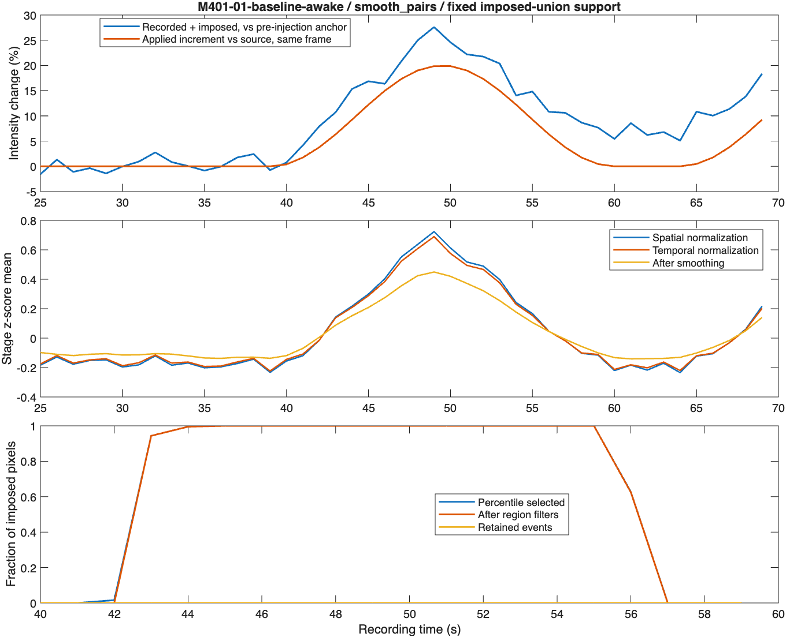

# Expanding/contracting surge and signal-stage evidence, 2026-09-09

See [findings, dependencies and proposed corrections](../../SURGE_SIGNAL_EVIDENCE.md).
Production code and contracts are unchanged from `03bdce8`. This update adds
validation and diagnostic tools; thresholds were fixed throughout the experiment.

## Prespecified experiment

Eight new full movies: growing and shrinking patches on each of ID400, ID401,
FB2312 and the separate FB2411 fluorescence control. These are four source
recordings, not eight independent biological samples. Dimensions and calibrations
match the preceding [continuity report](../surge-shape-continuity-20260909/README.md).
The archived motion-corrected series is preserved without intensity rescaling;
it is not represented as untouched camera output or calibrated oxygen values.

Both signs are imposed at separate stationary centers, at rounded 0.33/0.67 of
image width and 0.5 of height. During inclusive frames 101–160, the local intensity
factor is `1 ± 0.2*sin(pi*j/61)^2`, j=1…60. Radius changes linearly from 60 to
120 µm or from 120 to 60 µm. Outside this interval, pixels retain their source
values. Values are rounded into uint16 and clipping is prohibited. There is no
added noise, image crop or frame subsampling.

The previously processed, unchanged source controls are rescored against the
same growing/shrinking supports. They are not rerun or counted twice as biological
samples. Their reuse requires all production MATLAB file hashes to match the
preceding run. New validation-file additions do not change the detector contract.

Three prior cases receive detailed reconstruction: ID400 smooth pairs, ID401
smooth pairs and ID400 moving singleton. The first window of ID401 was also used
to check the new audit tools before launching the fixed full experiment. These
previously examined sources are development references, not a held-out test set.

## Completed results

All eight new master runs passed. **1,508 retained-event baseline/amplitude
records** match independent recalculation: 1,280 sinks and 228 surges. There are
759 finite amplitudes and 749 unavailable amplitudes across both signs. Six sink
and twelve surge amplitudes have the opposite raw direction to their detection
sign and remain visible; no absolute-value correction was applied.

The 85 focused tests pass, including seven new support/transition/normalization
checks. Final repository checks inspect 373 MATLAB files; the existing 73 Code
Analyzer messages remain, with none in the new diagnostic helpers inspected. Independent verification covers **1,310,709,748 constructed pixels** and
all **32 support-score rows** (two signs, two shape recipes, four sources, with
corresponding controls). All eleven case reconstructions reproduce saved surge
masks and candidate/gap ledgers. Original recorded MATLAB hashes still match;
the later contribution audit has its own source hash in its verification file.

Surge results use overlap of complete space-time sets (IoU). A value of 1 would
mean exact agreement with the imposed support; nonzero is not a success cutoff.
Native frame bounds below describe the best-overlapping retained event.

| Source | Shape | Challenge IoU | Unchanged-source IoU | Native bounds | Reported optical amplitude |
|---|---|---:|---:|---|---|
| ID400 | Growing | 0.2951 | 0.0195 | 127–152 | Unavailable |
| ID400 | Shrinking | 0.2022 | 0.0122 | 127–155 | Unavailable |
| ID401 | Growing | 0.3916 | 0 | 113–150 | 11.19% |
| ID401 | Shrinking | 0.4102 | 0 | 110–148 | 9.87% |
| FB2312 | Growing | 0.1643 | 0 | 133–143 | 10.39% |
| FB2312 | Shrinking | 0 | 0 | None | No matched event |
| FB2411 fluorescence control | Growing | 0 | 0 | None | No matched event |
| FB2411 fluorescence control | Shrinking | 0 | 0 | None | No matched event |

The imposed support is frames 101–160 in every case. Five of six BOI shape
challenges have a partial retained intersection; both fluorescence-control
challenges have none. This is not sensitivity/specificity, and unchanged-source
intersections show why overlap alone is insufficient to identify imposed events.

### Where support is lost

| Source | Shape | Frames with accepted pixels | Longest consecutive accepted-pixel stretch | Frames with retained pixels |
|---|---|---:|---:|---:|
| ID400 | Growing | 41 | 29 | 26 |
| ID400 | Shrinking | 45 | 24 | 24 |
| ID401 | Growing | 44 | 40 | 38 |
| ID401 | Shrinking | 43 | 40 | 39 |
| FB2312 | Growing | 49 | 41 | 11 |
| FB2312 | Shrinking | 46 | 24 | 0 |
| FB2411 fluorescence control | Growing | 10 | 6 | 0 |
| FB2411 fluorescence control | Shrinking | 22 | 8 | 0 |

These columns count any intersection with imposed pixels in a frame; they do
not say one individual candidate lasted that long. A native event can persist
while ceasing to intersect a shrinking imposed disk. `stage-summary.csv` also
retains individual filter-rejection counts and unlinked truth-to-truth edges.
Rejection predicates can overlap, and multiple edges can refer to one split.
For unlinked edges, `Reason` lists the first applicable failed fallback condition
(containment, then area ratio, then competing overlap); other failures may also
apply and can be reconstructed from the numerical columns.

The previously missed first ID401 paired pulse is especially diagnostic: all
imposed pixels are accepted through 14 consecutive frames, but a two-way region
split divides the event into two seven-frame runs. Its signal-bearing edge has
97.64% coverage of the smaller region, area ratio 1.847 and mutual coverage
52.86%; the competing successor blocks fallback. This directly identifies a
tracking/region-identity failure in this example, rather than signal erasure by
normalization. Other windows also lose support to geometry and missing candidates.



### Amplitude and baseline attribution

A post-experiment check separates positive and negative changed pixels in each
of the twelve matched surge footprints. It reproduces the saved net increment
and finds **no negative imposed contribution** in these footprints. Their small
applied increments are therefore not cancellation by the imposed sink.

For the five matched new shape surges, the peak imposed contribution averaged
on the detected footprint is only **2.87–5.64%**, despite a local imposed peak
near 20%. The footprints include uninjected pixels and pixels inactive during
parts of the shape change. Source brightness also weights the fractional mean.
The original recording's changes remain in the reported production amplitude,
so this range is not the total observed signal or a direct amplitude-error score.

All three new shape-surges with production-valid baselines have known rising
signal inside their native pre-event window:

| Matched surge | Baseline frames touching the imposed surge | Applied baseline uplift versus source |
|---|---:|---:|
| ID401 growing | 12 / 20 | 0.185% |
| ID401 shrinking | 9 / 20 | 0.314% |
| FB2312 growing | 20 / 20 | 3.520% |

These are known synthetic-tail contributions. They demonstrate the distinction
between passing detected-overlap/finite-sample checks and having an event-free
physiological baseline. No missing amplitude was filled or baseline rule relaxed.

## Development decision

Keep this experiment's production defaults fixed. The evidence supports
prioritizing **candidate separation and explicit split/merge identity**, then
choosing the spatial amplitude endpoint and validating onset/baseline together.
A bounded next comparison should test dominant-branch continuation against
independent neighboring signals, equal/unequal splits, mergers and crossings;
unmatched siblings must remain visible. Do not simply remove the isolation
guard or shorten duration because a known injected event would then survive.
The [dependency-ordered findings](../../SURGE_SIGNAL_EVIDENCE.md) specify the
remaining normalization and physical-smoothing limitations.

## Definitions and evidence files

- `shape-support-results.csv`: full native space-time intersection/union and
  intersecting retained runs for both signs, plus controls scored at the identical
  imposed geometry. An intersection is not an accuracy threshold.
- `independent-amplitude-audit.csv`: every retained event, including background
  detections and unavailable baselines, recalculated without the production
  amplitude finalizer.
- `recording-qc.csv`: retained-event totals and measurement availability, by sign.
- `footprint-contributions.csv`: post-experiment positive/negative decomposition
  on each matched footprint, with pixel counts and physical footprint area.
  Its helper was added after the frozen experiment; its own SHA-256 is recorded.
- `evidence/` and `prior-evidence/`: per-case fixed-support stage traces, individual
  threshold-region decisions, candidate-edge evidence and matched-surge signal
  diagnostics. Larger CSVs are losslessly compressed; runtime folders contain
  ordinary CSVs. Failed-edge counts are not counts of independent missed events.
- `stage-evidence.png`: top panels show surrounding baseline on the fixed imposed
  union; the bottom panel focuses on the imposed support interval. Read the time
  axis of each panel. Spatial/temporal z-scores and optical percentages use
  separate axes and cannot be interpreted as the same quantity.
- `AppliedChangeInNativePrebaselineFraction`: mean(challenge − source) divided
  by mean(source), on the event footprint over its whole native pre-event window.
  Production-excluded frames are included in this diagnostic. It is not a new
  production baseline or an imputed amplitude.
- `PeakAppliedChangeOnEventFootprint`: maximum same-frame fractional increment
  versus source during the imposed support, averaged on the detected event's
  fixed union footprint. This isolates the imposed contribution; total recorded
  amplitude also contains original fluctuations and uses a pre-event reference.
- `FullSupportPeakFromAnchorFraction`: challenged-movie peak on the event footprint
  during the imposed support, relative to an anchor before the first imposed
  signal. It is a diagnostic comparison, not validated physiological timing.

Production preprocessing is reused to localize failures. Filtering decisions and
tracking edges are separately reconstructed with explicit predicates. Final
surge masks and all candidate/gap ledger values must match the saved outputs.
Independent space-time-set scoring verifies the numerical support scores.

## Reproduction

With the pinned converted archive sources and preceding control outputs present:

```matlab
setupOxygenDynamicsPath;
addpath('tests/analysis');
runSurgeShapeEvidenceValidation('../reference-validation/phase1-optimized-20260909', ...
    '../reference-validation/surge-shape-continuity-20260909', 'NEW_OUTPUT_ROOT');
auditSurgeShapeSupportScores('NEW_OUTPUT_ROOT', ...
    '../reference-validation/surge-shape-continuity-20260909');
auditSurgeFootprintContributions('NEW_OUTPUT_ROOT', ...
    '../reference-validation/surge-shape-continuity-20260909');
```

Use `tests/analysis/verify_shape_evidence_inputs.py NEW_OUTPUT_ROOT` with NumPy
and Pillow for independent source/recipe/pixel verification. Large outputs remain
in `reference-validation/surge-shape-evidence-20260909` beside the repository.
The production normalization identity remains `spatial-sd_then_temporal-sd`.
